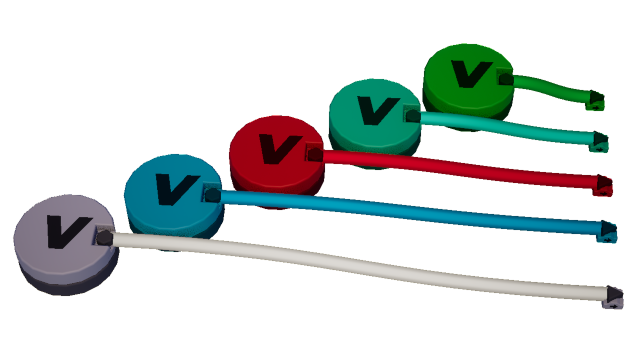

# Adding Variables

In the context of Brickadia's wires, variables are circular gate bricks
storing values that can be accessed or modified from anywhere at any time.
They are an integral part of Wires themselves and enable new sequencing
and organization capabilities.

By default, gates do not need variables and you can use the Applicator to
determine their input values instead. It is recommended to use variables
where applicable.

## Variable Gate

The Variable gate is a gate shaped like a cylinder found in the Catalog
under the Bricks tab, in the "*Wires - Exec*" category and under the
"*Variables*" subcategory.

### Outputs

* **:material-variable: Variable Reference** 
Variable reference for other gates to fetch from.
Does not send the variable's value.
This output is located at the bottom of the gate and is hidden unless you
equip the Wire Tool.
**Use this output for all variable related operations.**
* **:material-export: Physical Output** 
Outputs the variable's value in *real time*.
Visible even without the Wire Tool equipped.
**Use this output if part of your circuit(s) rely on certain variables.**

## Variable configuration

Configuring your variable gate bricks requires the use of the
[Applicator](). When you click on a Variable gate with the *Applicator*,
this component is where you will edit the type and value of the variable
tied directly to the brick itself.

**:material-memory: Var**{.comp}

### Value types

In the Applicator menu, you can change your value type and edit the value
stored in the current variable gate you have clicked on.
The image below is all possible value types you can assign to a variable.

The following Value types can be assigned to Variable gates:

* [:material-decimal-increase: Float](){.float} 
Known as *"Number"* in Applicator menu.
* [:material-numeric: Integer](){.int}
* [:material-sort-bool-ascending: Boolean](){.bool} 
Known as *"True/False"* in Applicator menu.
* [:material-cube-send: Entity](){.ent} 
Known as *"Object"* in Applicator menu.
Entities include brick grids, players or bots.
* [:material-arrow-expand-right: Exec](){.exec}
