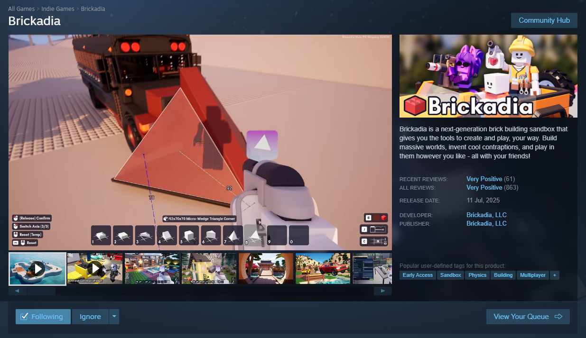
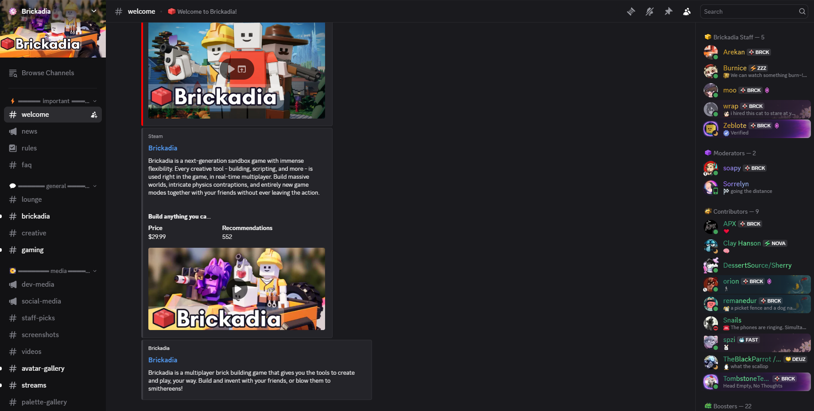

# General

## Storefronts

Brickadia is currently exclusive to the Steam storefront with the price of $30
and is Early Access at the time of writing.

An in-game account is required, but you will be able to create one in-game.
There are no restrictions, DRM or encryptions that come along with the game.
This game can be played offline in offline mode.

## Platforms

Brickadia is currently available on these platforms:

* **:material-monitor: Windows** - Windows 10 or higher. Windows 11 is recommended.
* **:material-penguin: Linux** - ran through Proton, as the developers have stated
it ran better than the native Linux build

## Performance

Brickadia runs on [**Unreal Engine 5**](https://www.unrealengine.com/).

A gaming-class card with 4GB of video memory or more, 12GB system memory or more and a
adequate modern processor of 6 or more cores is recommended. Modern systems will support
and take advantage of *DirectX 12* with no issue. For older systems, I recommend *DirectX 11*
for better performance on those systems. For systems with inadequate CPU or GPU, the
*Simple Graphics* option serves as a fallback option in case of catastrophic performance.
You wouldn't explode a potato.

An aspect ratio of 16:9 is ideal as the UI is built for wide-screen and will down-size
if you choose something like 4:3. Brickadia also supports capping at framerates higher
than 60 for those with displays of higher refresh rate. It also has an unfocused framerate
cap, which will help save on GPU resources if you are working on something else while
Brickadia is open in the background.

You can expect varying levels of performance due to the natural variance of
servers and worlds, meaning there is no central benchmark. Some worlds or servers
will be heavy on performance, and some may be light enough to be able to run
on integrated graphics without going under tolerable framerates.

## Social

You can follow or interact the official Brickadia social media accounts here:

* [**TikTok**](https://www.tiktok.com/@brickadia)
* [**Youtube**](https://youtube.com/@brickadia)
* [**Twitter ...or X but I will give you a side eye**](https://twitter.com/brickadiagame)
* [**Instagram**](https://www.instagram.com/brickadiagame/)
* [**Bluesky**](https://bsky.app/profile/brickadia.com)
* [**Reddit**](https://reddit.com/r/brickadia)

## Forums

We have a [**Discord**](https://discord.gg/brickadia), but no forum yet.
Any other forum is unofficial and not affiliated with the official team working
with the game.

In the Discord, you can ask questions about the game
and showcase your projects.
